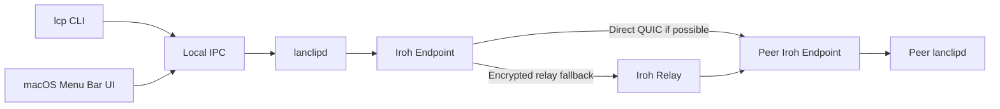
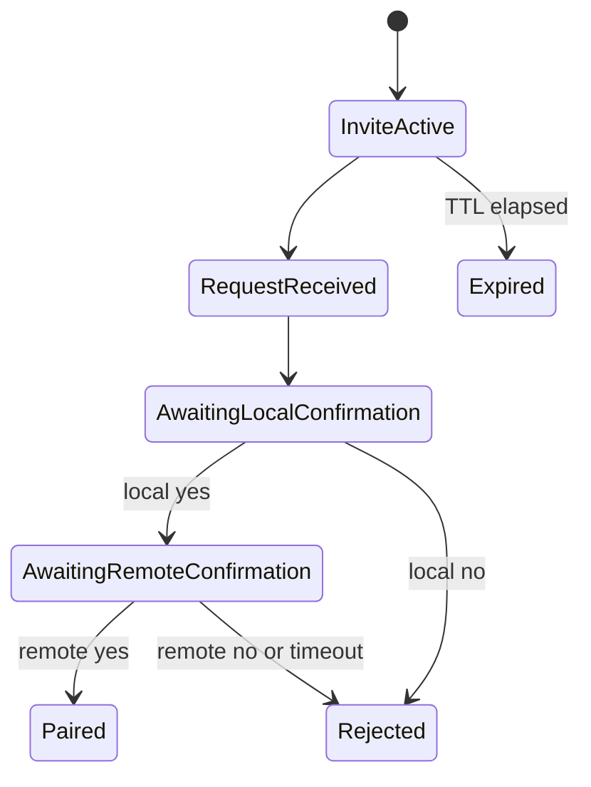

# LCP — Agentic Implementation Specification

> Source of truth สำหรับการออกแบบและ implement ระบบ LCP ทั้งหมด  
> Target: macOS + Windows  
> Working binary names: `lcp` และ `lanclipd`  
> Document version: 1.0  
> Date: 27 August 2026

## 0. Instructions for the Implementing Agent

เอกสารนี้เป็น normative specification คำว่า **MUST**, **MUST NOT**, **SHOULD**, **SHOULD NOT** และ **MAY** ให้ตีความตามความเข้มงวดแบบ RFC 2119

Agent ที่นำเอกสารนี้ไป implement ต้อง:

1. อ่านเอกสารทั้งหมดก่อนแก้หรือสร้าง code
2. ทำตาม phase order ที่กำหนด และทำให้แต่ละ phase ผ่าน tests ก่อนเริ่ม phase ถัดไป
3. ห้ามเปลี่ยน product behavior, command semantics, persistence policy หรือ security model โดยไม่บันทึกเป็น Architecture Decision Record
4. ใช้ stable Rust toolchain และ pin dependency versions ใน `Cargo.lock`
5. ตรวจ official documentation ของ dependency version ที่เลือกก่อน implement เพราะ Iroh และ ecosystem อาจเปลี่ยน API
6. ห้ามสร้าง cryptographic primitive, NAT traversal หรือ relay protocol เอง
7. ห้าม log message content, clipboard content, private key, invite secret หรือ raw pairing ticket
8. ห้ามเพิ่ม database, account system, cloud message history, offline queue หรือ Windows GUI
9. ต้องรักษา cross-platform build ตั้งแต่ phase แรก ไม่เขียน core logic ที่ผูกกับ macOS
10. ต้องส่งมอบ code, tests, build instructions และ runnable artifacts สำหรับ macOS และ Windows

ถ้า implementation detail ใดไม่ถูกระบุ ให้เลือกวิธีที่:

1. ปลอดภัยกว่า
2. เรียบง่ายกว่า
3. cross-platform กว่า
4. ใช้ dependency ที่ mature และ maintained
5. ไม่ทำให้ UX ช้าลงโดยไม่มีเหตุผล

---

## 1. Product Definition

### 1.1 Product Summary

LCP เป็นโปรแกรมขนาดเล็กสำหรับส่ง code และ UTF-8 plain text ระหว่างเพื่อนอย่างรวดเร็ว ใช้ได้ระหว่าง macOS และ Windows แม้อยู่คนละ Wi-Fi หรือคนละ network

ระบบประกอบด้วย:

- `lanclipd`: Rust daemon ที่ทำงานเบื้องหลัง รับข้อความ realtime และรักษา peer connections
- `lcp`: Rust CLI สำหรับ pair, send, fetch, copy และเลือกข้อความ
- `LCPMenuBar`: native macOS menu bar UI ที่ทำภายหลังและใช้ daemon ตัวเดียวกับ CLI

Windows ใช้ CLI + daemon เท่านั้นใน scope นี้ ไม่มี Windows tray GUI

### 1.2 Product Principles

- **Speed first:** คำสั่ง CLI ต้องเปิดเร็วและทำงานผ่าน local IPC โดยไม่สร้าง network stack ใหม่ทุกครั้ง
- **Realtime receive:** daemon ต้องรับข้อความตลอดเวลาที่กำลังทำงาน แม้ไม่มี terminal หรือ UI เปิดอยู่
- **Pair once:** หลัง Pair แล้วต้องจำ peer ข้าม restart และเปลี่ยน network
- **Cross-network:** ไม่บังคับให้อยู่ LAN เดียวกัน
- **Direct when possible:** เชื่อม P2P โดยตรงเมื่อทำได้
- **Relay fallback:** ใช้ encrypted relay เมื่อ direct connection ทำไม่ได้
- **End-to-end encrypted:** relay ต้องอ่าน message content ไม่ได้
- **Local state:** trusted peers เก็บในเครื่อง; message history อยู่ใน RAM เท่านั้น
- **No account:** ไม่มี email, password, login หรือ global user directory
- **No database:** ไม่ใช้ SQLite, Core Data, SwiftData หรือ remote database
- **Minimal UI:** UI หลักต้องไม่มี feature ที่ไม่จำเป็นต่อ send/copy workflow

### 1.3 Primary Users

- นักพัฒนาและนักศึกษาที่ใช้ terminal เป็น
- กลุ่มเพื่อนขนาดเล็กประมาณ 2–10 คน
- ผู้ใช้ที่ส่ง code, command, URL, error message และ text หลายบรรทัดบ่อย ๆ
- macOS และ Windows users

### 1.4 Core User Stories

1. ในฐานะผู้ใช้ ฉัน Pair กับเพื่อนด้วย ticket เพียงครั้งเดียวแล้วเรียกเพื่อนด้วยชื่อเดิมได้ตลอด
2. ฉันส่ง clipboard ปัจจุบันให้เพื่อนด้วย `lcp send First`
3. ฉันนำข้อความล่าสุดจาก First เข้า clipboard ด้วย `lcp copy First`
4. ฉันนำข้อความล่าสุดจากใครก็ได้เข้า clipboard ด้วย `lcp copy`
5. ฉันพิมพ์ข้อความล่าสุดออก stdout ด้วย `lcp fetch First` เพื่อ pipe เข้าโปรแกรมอื่น
6. ฉันเลือกข้อความเก่าจาก interactive list ด้วย `lcp pick First`
7. ฉันดู trusted peers และ connection status ด้วย `lcp peers`
8. บน macOS ฉันทำ workflow เดียวกันผ่าน menu bar panel ได้โดยไม่เปิด main window

---

## 2. Scope

### 2.1 Required Scope

- Rust daemon บน macOS arm64/x86_64 และ Windows x86_64
- Rust CLI บน macOS arm64/x86_64 และ Windows x86_64
- Native macOS menu bar UI
- Iroh endpoint transport
- Direct QUIC connection เมื่อเป็นไปได้
- Iroh relay fallback
- End-to-end encrypted transport
- Pairing ด้วย application-specific Iroh ticket
- Persistent device identity
- Persistent trusted peer list
- In-memory conversation history
- Cross-platform clipboard accessใน CLI
- Auto-start daemon แบบ per-user
- Auto-reconnect
- Local IPC ระหว่าง client กับ daemon
- Automated tests และ CI build matrix

### 2.2 Explicit Non-Goals

- Windows GUI หรือ tray UI
- Linux support ใน release แรก
- iOS, Android หรือ browser client
- Same-LAN-only discovery
- Bluetooth pairing
- Six-digit-only remote pairing
- Account, email, login หรือ friend directory
- Offline message queue
- Cloud message history
- Persistent clipboard/message history
- Group chat
- File transfer
- Images, rich text หรือ syntax highlighting
- Automatic monitoring หรือ sharing ทุกครั้งที่กด Copy
- Message editing, deletion sync, reactions หรือ read receipts
- Custom NAT traversal, STUN, TURN, QUIC หรือ cryptographic implementation

### 2.3 Environmental Assumptions

- ทั้งสองเครื่องมี internet access
- daemon ของผู้รับกำลังทำงาน
- Iroh public relay/address lookup infrastructure เข้าถึงได้ หรือผู้ใช้ configure relay อื่น
- จำนวน trusted peers ไม่เกินประมาณ 50 และ online พร้อมกันไม่เกินประมาณ 10
- Message size สูงสุด 5 MiB
- ไม่มี delivery guarantee เมื่อ peer offline

---

## 3. Final Architecture

### 3.1 System Overview



### 3.2 Process Model

`lanclipd` เป็น long-running per-user daemon และเป็นเจ้าของ state ทั้งหมด:

- Iroh endpoint และ secret identity
- trusted peers
- active invitations
- peer connections
- conversation history ใน RAM
- latest incoming message indexes
- deduplication cache
- reconnect tasks

`lcp` และ macOS UI เป็น stateless clients:

- ส่ง request เข้า daemon ผ่าน local IPC
- รับ response และ realtime events
- อ่าน/เขียน system clipboard ที่ client process
- ห้ามเปิด Iroh endpoint ของตัวเอง
- ห้ามมี duplicate network state

### 3.3 Why a Daemon Is Required

CLI process ทำงานเพียงช่วงสั้น ๆ จึงไม่สามารถรับข้อความ realtime ได้ด้วยตัวเอง Daemon ต้องทำงานตลอดเพื่อ:

- รับ incoming connection
- รับข้อความแม้ terminal ปิดอยู่
- เก็บ latest message ใน RAM
- รักษา stable Endpoint ID
- reconnect peers
- ตอบ `copy` และ `fetch` ผ่าน local IPC ทันที

### 3.4 Transport Decision

ใช้ Iroh แทน raw TCP/mDNS เพราะระบบต้องทำงานข้าม network และหลัง NAT

Iroh responsibilities:

- Endpoint identity
- QUIC transport
- Encryption
- NAT traversal
- Direct-path selection
- Relay fallback
- Address lookup

Application responsibilities:

- Pairing workflow
- Trusted peer allowlist
- Message schema และ validation
- ACK และ deduplication
- Conversation state
- CLI และ UI
- Local IPC

### 3.5 Infrastructure Policy

MVP ใช้ Iroh public relays/default preset สำหรับ development และ personal use

ข้อกำหนด:

- MUST ทำ relay configuration ให้เปลี่ยนได้ในอนาคต
- MUST NOT hardcode application logic ให้ผูกกับ relay URL เดียว
- MUST แสดงใน `lcp doctor` ว่ากำลังใช้ public หรือ custom relay
- MUST document ว่า public relays ไม่มี production SLA
- MAY รองรับ dedicated/self-hosted relay ภายหลังโดยไม่เปลี่ยน wire protocol

ระบบนี้ไม่มี application-owned message server และไม่มี pairing rendezvous server

---

## 4. Repository and Workspace Structure

```text
lcp/
├── Cargo.toml
├── Cargo.lock
├── rust-toolchain.toml
├── README.md
├── LICENSE
├── docs/
│   ├── architecture.md
│   ├── protocol.md
│   ├── security.md
│   └── troubleshooting.md
├── crates/
│   ├── lcp-protocol/
│   │   └── src/
│   │       ├── lib.rs
│   │       ├── network.rs
│   │       ├── ipc.rs
│   │       ├── ticket.rs
│   │       └── error.rs
│   ├── lcp-core/
│   │   └── src/
│   │       ├── lib.rs
│   │       ├── state.rs
│   │       ├── identity.rs
│   │       ├── peers.rs
│   │       ├── pairing.rs
│   │       ├── transport.rs
│   │       ├── connection.rs
│   │       ├── conversation.rs
│   │       ├── config.rs
│   │       └── diagnostics.rs
│   ├── lcp-ipc/
│   │   └── src/
│   │       ├── lib.rs
│   │       ├── client.rs
│   │       ├── server.rs
│   │       ├── unix.rs
│   │       └── windows.rs
│   ├── lanclipd/
│   │   └── src/main.rs
│   └── lcp-cli/
│       └── src/
│           ├── main.rs
│           ├── commands/
│           ├── clipboard.rs
│           ├── output.rs
│           └── picker.rs
├── macos/
│   └── LCPMenuBar/
│       ├── LCPMenuBar.xcodeproj
│       └── LCPMenuBar/
│           ├── AppDelegate.swift
│           ├── StatusItemController.swift
│           ├── MenuBarPanel.swift
│           ├── IPCClient.swift
│           ├── AppStore.swift
│           ├── Views/
│           │   ├── FriendListView.swift
│           │   ├── FriendRowView.swift
│           │   ├── ConversationView.swift
│           │   ├── MessageRowView.swift
│           │   └── MessageComposerView.swift
│           └── Resources/
├── tests/
│   ├── integration/
│   └── fixtures/
├── scripts/
│   ├── install-macos.sh
│   ├── uninstall-macos.sh
│   ├── install-windows.ps1
│   └── uninstall-windows.ps1
└── .github/workflows/
    ├── ci.yml
    └── release.yml
```

### 4.1 Crate Boundaries

| Crate          | Responsibility                                                        |
| -------------- | --------------------------------------------------------------------- |
| `lcp-protocol` | Pure types, serialization, versioning และ errors; ไม่มี I/O           |
| `lcp-core`     | Iroh endpoint, pairing, peer state, conversations และ security policy |
| `lcp-ipc`      | Cross-platform local IPC server/client abstraction                    |
| `lanclipd`     | Process startup, shutdown, signal handling และ wiring                 |
| `lcp-cli`      | CLI parsing, clipboard, terminal picker และ output                    |

Dependency direction MUST เป็น:

```text
lcp-protocol <- lcp-core <- lanclipd
lcp-protocol <- lcp-ipc  <- lanclipd
lcp-protocol <- lcp-ipc  <- lcp-cli
```

ห้ามให้ `lcp-core` depend on CLI หรือ macOS UI

---

## 5. Technology Stack

### 5.1 Core

| Area                    | Technology                                                                      |
| ----------------------- | ------------------------------------------------------------------------------- |
| Language                | Stable Rust                                                                     |
| Async runtime           | Tokio                                                                           |
| Cross-network transport | Iroh                                                                            |
| CLI parsing             | Clap derive                                                                     |
| Serialization           | Serde + Postcard สำหรับ network/ticket; Serde JSON สำหรับ local IPC             |
| IDs                     | UUID v4 สำหรับ messages; Iroh Endpoint ID สำหรับ devices                        |
| Config paths            | `directories` หรือ platform-standard equivalent                                 |
| Secret storage          | OS credential store ผ่าน maintained Rust adapter                                |
| Clipboard               | `arboard` ใน CLI process                                                        |
| Terminal picker         | Crossterm; Ratatui MAY be used if it materially simplifies accessible selection |
| Logging                 | `tracing` + platform-appropriate file appender                                  |
| Errors                  | `thiserror` ใน libraries; `anyhow` เฉพาะ binary boundaries                      |
| Tests                   | Rust unit/integration tests + Tokio test utilities                              |

### 5.2 macOS UI

| Area                | Technology                                                           |
| ------------------- | -------------------------------------------------------------------- |
| Lifecycle/windowing | AppKit                                                               |
| View layer          | SwiftUI embedded in AppKit                                           |
| Menu bar            | `NSStatusItem`                                                       |
| Popup               | `NSPanel` with `.nonactivatingPanel`                                 |
| Rust communication  | Local IPC only; no Rust FFI required                                 |
| Clipboard           | `NSPasteboard`                                                       |
| Auto-start          | Daemon installer/LaunchAgent; UI MAY use `SMAppService` when bundled |

### 5.3 Dependency Policy

- Use latest stable compatible versions at implementation time
- Pin exact resolved versions in `Cargo.lock`
- Avoid unmaintained crates
- Prefer official Iroh APIs and official examples
- Do not add SQL, ORM, HTTP server framework หรือ web frontend framework
- Do not depend on OpenSSL when Rust-native/platform-supported alternatives exist
- Every dependency that handles secrets, networking or IPC MUST be documented in `docs/security.md`

---

## 6. Persistent and Ephemeral Data

### 6.1 Persistent Data

Only the following data persists across daemon restarts:

- Local display name
- Stable local device ID
- Iroh secret identity key in OS credential store
- Trusted peer Endpoint IDs
- Peer aliases
- Peer display/device metadata from pairing
- Config values
- Protocol/config schema version

### 6.2 Ephemeral Data

The following MUST remain in RAM only:

- Incoming message content
- Outgoing message content
- Conversation history
- Latest incoming message indexes
- Active invite secrets
- Pending pairing sessions
- Deduplication cache
- Active connections and reconnect state

### 6.3 No Message Persistence

เมื่อ daemon restart:

- Pairing/trusted peers MUST remain
- Message history MUST be empty
- `lcp copy` MUST return `No messages received since daemon start`
- `lcp pick` MUST show an empty-state message
- No peer MUST be automatically asked to resend historical messages

### 6.4 Storage Locations

Suggested paths:

```text
macOS config:  ~/Library/Application Support/lcp/config.json
macOS logs:    ~/Library/Logs/lcp/
macOS socket:  ~/Library/Application Support/lcp/lanclipd.sock

Windows config: %APPDATA%\lcp\config.json
Windows logs:   %LOCALAPPDATA%\lcp\logs\
Windows pipe:   \\.\pipe\lcp-<current-user-identifier>
```

Requirements:

- Config file MUST NOT contain private identity key
- macOS socket permissions MUST be `0600`
- Windows named pipe MUST restrict access to current user SID
- Logs MUST be bounded/rotated
- Message content and tickets MUST NOT appear in logs

### 6.5 Config Schema

```json
{
    "schema_version": 1,
    "user": {
        "name": "Ideal",
        "device_name": "Ideal's MacBook"
    },
    "history": {
        "limit_per_peer": 100
    },
    "message": {
        "max_bytes": 5242880
    },
    "daemon": {
        "autostart": true
    },
    "network": {
        "relay_mode": "default"
    },
    "trusted_peers": [
        {
            "endpoint_id": "<iroh-endpoint-id>",
            "alias": "First",
            "remote_display_name": "First",
            "device_name": "First-PC",
            "paired_at": "2026-08-27T12:00:00Z"
        }
    ]
}
```

Peer alias rules:

- MUST be unique case-insensitively
- MUST be 1–32 Unicode scalar values after trimming
- MUST NOT contain control characters
- CLI accepts alias or unambiguous Endpoint ID prefix
- Ambiguous identifiers MUST fail and list candidates

---

## 7. Identity and Pairing

### 7.1 Stable Identity

On first daemon launch:

1. Generate one Iroh secret key using official API
2. Store secret bytes in OS credential store
3. Persist only non-secret metadata in config
4. On future launches, load the same secret key
5. If the secret is missing but trusted peers exist, fail safely and explain that identity recovery/re-pairing is required

The Iroh Endpoint ID is the canonical device identity

Reinstalling, clearing credential storage or resetting identity creates a new device and requires pairing again

### 7.2 Why Tickets Are Used

Devices may be on different networks, so a peer name or six-digit code cannot identify a routable endpoint by itself

Pairing uses an application-specific ticket containing:

- Iroh endpoint dialing information
- Inviter Endpoint ID
- Random invite secret
- Expiration timestamp
- Protocol version
- Non-sensitive inviter display metadata

### 7.3 Application Ticket Schema

```rust
struct PairingTicketV1 {
    version: u8,
    endpoint_ticket: String,
    invite_secret: [u8; 32],
    expires_at_unix_ms: i64,
    inviter_display_name: String,
    inviter_device_name: String,
}
```

Encoding:

- Serialize with Postcard
- Encode lowercase Base32 or URL-safe Base64 without padding
- Prefix with `lcp1_`
- Parser MUST reject unknown versions, malformed input and oversized tickets
- Ticket text MUST be accepted as one CLI argument

### 7.4 Invite Creation

Command:

```bash
lcp invite
```

Required behavior:

1. CLI requests daemon to create invite
2. Daemon generates 32-byte cryptographically secure `invite_secret`
3. Default TTL is 5 minutes
4. Daemon stores active invite in RAM only
5. CLI prints ticket and copies ticket to clipboard by default
6. CLI remains attached and waits for a pairing request
7. Closing CLI cancels the invite unless macOS UI owns the invite session
8. Invite is single-use at application layer
9. Invite is invalidated after success, explicit cancellation or expiry

Output example:

```text
Pairing ticket copied to clipboard.

lcp1_abcd...xyz

Waiting for a peer for 5 minutes. Press Ctrl+C to cancel.
```

Options:

```bash
lcp invite --ttl 300
lcp invite --no-copy
```

TTL MUST be bounded between 60 and 900 seconds

### 7.5 Pair Command

```bash
lcp pair <ticket>
```

Required behavior:

1. Parse and validate ticket locally
2. Reject expired ticket before network connection
3. Connect to inviter Endpoint ID through Iroh
4. Send pairing request containing invite secret, joiner Endpoint ID and display metadata
5. Inviter daemon verifies active secret using constant-time comparison
6. Both sides derive the same short authentication string from the authenticated handshake transcript
7. Both sides display peer identity and verification string
8. Both users must confirm
9. Trust is committed only after both confirmations are exchanged
10. Both sides persist the remote Endpoint ID and alias
11. Active invite is invalidated

### 7.6 Verification String

Display format SHOULD be three words plus four digits, for example:

```text
mango-river-pencil-4821
```

Derivation input MUST include:

- Both Endpoint IDs in canonical sorted order
- Invite secret
- Both random handshake nonces
- Protocol context string `lcp-pairing-v1`

Use a standard cryptographic hash/KDF from a maintained crate Do not use the verification string as an encryption key

### 7.7 Confirmation State Machine



Pairing confirmation timeout after connection MUST be 120 seconds or less

### 7.8 Trust Enforcement

- Normal message connections MUST be accepted only from Endpoint IDs in trusted peer store
- Unknown endpoints MUST receive a generic unauthorized response and be closed
- Pairing protocol MUST be active only while an invite exists
- Peer display name received over network MUST NOT override local alias
- `lcp unpair` MUST revoke trust immediately and close active connection
- Reusing an old ticket after invite expiry MUST fail

### 7.9 Ticket Privacy

Iroh tickets may contain network addresses Treat ticket as sensitive connection metadata

- Never log ticket
- Never include ticket in crash reports
- Warn user not to publish it
- Ticket does not grant permanent trust without user confirmation
- Application-level invite secret and TTL are required even though the underlying endpoint ticket may technically be reusable

---

## 8. Network Protocol

### 8.1 ALPN and Version

Use a dedicated ALPN:

```text
lcp/1
```

Protocol version mismatch MUST fail clearly and MUST NOT silently downgrade

### 8.2 Connection Model

- One Iroh Endpoint per daemon
- At most one preferred authenticated connection per trusted peer
- Either side may initiate
- Simultaneous connections MUST be resolved deterministically using sorted Endpoint IDs
- Lower Endpoint ID SHOULD own the outbound preferred connection; the other connection is closed after authentication
- Cache live connections
- `send` MUST trigger immediate reconnect attempt even during normal backoff
- Use Iroh/QUIC keepalive facilities when officially supported

### 8.3 QUIC Stream Model

Use one bidirectional QUIC stream per request/message operation

For a text message:

1. Sender opens bidirectional stream
2. Sender writes one framed `NetworkEnvelope`
3. Sender finishes send side
4. Receiver reads with strict byte limit
5. Receiver validates and stores message
6. Receiver writes ACK on same bidirectional stream
7. Sender marks message sent after ACK

Do not create a custom multiplexing layer over one long-lived byte stream

### 8.4 Network Envelope

```rust
struct NetworkEnvelope {
    protocol_version: u16,
    request_id: Uuid,
    body: NetworkBody,
}

enum NetworkBody {
    Text(TextPayload),
    Ack(AckPayload),
    Ping,
    Pong,
    PairRequest(PairRequest),
    PairDecision(PairDecision),
    Error(NetworkErrorPayload),
}

struct TextPayload {
    message_id: Uuid,
    sender_endpoint_id: String,
    sent_at_unix_ms: i64,
    text: String,
}

struct AckPayload {
    message_id: Uuid,
    accepted: bool,
    error_code: Option<String>,
}
```

### 8.5 Serialization and Framing

- Serialize network envelope with Postcard
- Prefix serialized bytes with unsigned 32-bit big-endian length
- Maximum frame size MUST be slightly above maximum message size and hard-capped at 6 MiB
- Reject zero-length and oversized frames before allocation
- Use bounded reads and timeouts
- Reject invalid UTF-8 text through normal deserialization validation
- Unknown enum/version MUST return protocol error then close stream or connection as appropriate

### 8.6 Message Limits

```text
Maximum UTF-8 text bytes: 5 MiB = 5,242,880 bytes
Maximum wire frame:       6 MiB
Send timeout:             5 seconds after connection is ready
Connect attempt timeout:  8 seconds
ACK timeout:              5 seconds
```

Limits MUST be configurable only downward in MVP; do not allow user config above hard cap

### 8.7 Delivery Semantics

- No offline queue
- Sender generates UUID v4 message ID
- Receiver keeps bounded in-memory deduplication set
- Duplicate message ID from same Endpoint ID MUST return the original accepted ACK without adding history again
- CLI `send` waits for ACK before reporting success
- If peer is unreachable or ACK times out, command fails
- Failed outgoing attempt MAY appear in current in-memory conversation with status `failed`
- Retry creates a new send attempt using the same message ID until accepted or abandoned
- No guarantee survives daemon restart

### 8.8 Ordering

- TCP timestamps are not used to determine global latest
- Receiver assigns a monotonically increasing `receive_sequence` when an incoming message is accepted
- `lcp copy` without peer returns the incoming message with highest `receive_sequence`
- `lcp copy <peer>` returns the incoming message from that peer with highest `receive_sequence`
- Sender timestamp is display metadata only because clocks may differ

### 8.9 Connection Status

Peer status values:

```text
online     authenticated live connection exists
connecting connection attempt is active
offline    recent attempt failed or connection closed
unknown    no recent reachability result
```

If Iroh exposes direct-vs-relay path information in the selected stable API, expose:

```text
direct
relay
unknown
```

Path type MUST be treated as diagnostic information, not application correctness

### 8.10 Reconnect Policy

- Reconnect trusted peers in background
- Backoff: 250 ms, 500 ms, 1 s, 2 s, 5 s, then remain capped at 10 s
- Add 10–25% random jitter
- Reset backoff after stable authenticated connection
- Wake/network-change event SHOULD trigger immediate retry
- Explicit `send` MUST trigger immediate retry
- Never busy-loop

---

## 9. In-Memory State Model

```rust
struct AppState {
    local_identity: LocalIdentity,
    trusted_peers: HashMap<EndpointId, TrustedPeer>,
    peer_runtime: HashMap<EndpointId, PeerRuntimeState>,
    conversations: HashMap<EndpointId, Conversation>,
    latest_incoming_global: Option<MessageRef>,
    active_invites: HashMap<InviteId, ActiveInvite>,
    dedup: BoundedDedupCache,
    next_receive_sequence: u64,
}

struct Conversation {
    messages: VecDeque<StoredMessage>,
    latest_incoming: Option<MessageId>,
}

struct StoredMessage {
    id: Uuid,
    peer_id: EndpointId,
    direction: Direction,
    sender_label: String,
    text: String,
    sent_at_unix_ms: i64,
    received_at_unix_ms: i64,
    receive_sequence: Option<u64>,
    status: MessageStatus,
}

enum Direction {
    Incoming,
    Outgoing,
}

enum MessageStatus {
    Sending,
    Sent,
    Received,
    Failed,
}
```

History policy:

- Default 100 messages per peer
- Minimum configurable limit 20
- Maximum configurable limit 500
- Drop oldest message when limit exceeded
- Dedup cache SHOULD hold at least 2× total history capacity with hard memory bound
- Message text MUST not be cloned unnecessarily
- State mutation occurs behind one concurrency-safe owner/actor abstraction

---

## 10. Local IPC Protocol

### 10.1 Platform Transport

```text
macOS:  Unix domain socket
Windows: named pipe
```

Requirements:

- Current-user-only access
- No loopback TCP fallback by default
- Daemon creates endpoint atomically
- Stale macOS socket is removed only after verifying no daemon owns it
- Windows pipe name includes stable current-user identifier
- Clients perform protocol handshake before commands

### 10.2 IPC Framing

- 4-byte big-endian length prefix
- JSON UTF-8 body
- Hard cap 6 MiB
- Supports request, response and unsolicited event frames

### 10.3 IPC Types

```rust
struct IpcRequest {
    ipc_version: u16,
    id: Uuid,
    method: String,
    params: serde_json::Value,
}

struct IpcResponse {
    ipc_version: u16,
    id: Uuid,
    ok: bool,
    result: Option<serde_json::Value>,
    error: Option<IpcError>,
}

struct IpcEvent {
    ipc_version: u16,
    event: String,
    payload: serde_json::Value,
}
```

### 10.4 Required IPC Methods

```text
hello
get_status
get_config
set_config
list_peers
create_invite
cancel_invite
join_invite
confirm_pairing
reject_pairing
unpair_peer
send_text
get_latest_incoming
list_messages
retry_message
subscribe
shutdown
run_diagnostics
```

### 10.5 Required IPC Events

```text
daemon_ready
peer_updated
message_received
message_updated
pairing_requested
pairing_updated
invite_expired
config_updated
diagnostic_updated
```

### 10.6 Subscription

CLI commands that wait for pairing and macOS UI require event subscription

- Client calls `subscribe`
- Daemon keeps IPC connection open
- Events are best-effort current-process notifications
- On reconnect, client MUST call snapshot methods before relying on new events
- Events MUST NOT be used as the only source of state truth

---

## 11. CLI Specification

### 11.1 General Rules

- Binary name: `lcp`
- Human-readable output by default
- `--json` for structured commands
- `fetch` outputs raw message content by default
- Errors go to stderr
- Successful raw content goes to stdout
- Never print raw message content unless command semantics explicitly request it
- Auto-start daemon when safe and configured
- Commands MUST fail clearly if daemon cannot start

### 11.2 Global Flags

```bash
lcp --help
lcp --version
lcp --json
lcp --quiet
lcp --verbose
```

`--json` applies only to commands with structured output It MUST NOT wrap raw `fetch` content unless an explicit `fetch --json` is supplied

### 11.3 Config

```bash
lcp config set user.name Ideal
lcp config get user.name
lcp config list
```

Supported writable keys in MVP:

```text
user.name
user.device_name
history.limit_per_peer
daemon.autostart
network.relay_mode
```

Do not implement configuration through `lcp --config user.name Ideal`

### 11.4 Peers

```bash
lcp peers
lcp peers --json
```

`peers` lists trusted contacts, not nearby LAN devices

Human output:

```text
NAME      DEVICE       STATUS      PATH
First     First-PC     online      relay
Beam      Beam-Mac     online      direct
Ideal     MacBook      offline     -
```

JSON output MUST use stable field names:

```json
[
    {
        "endpoint_id": "...",
        "alias": "First",
        "device_name": "First-PC",
        "status": "online",
        "path": "relay"
    }
]
```

### 11.5 Invite and Pair

```bash
lcp invite
lcp pair <ticket>
lcp unpair <peer>
```

`unpair` requires confirmation unless `--yes` is supplied `--yes` MUST NOT bypass initial pairing identity confirmation

### 11.6 Send

```bash
lcp send First
lcp send First --stdin
lcp send First --text "npm run dev"
```

Sources are mutually exclusive:

- No source flag: read plain text from system clipboard
- `--stdin`: read stdin until EOF with 5 MiB cap
- `--text`: use argument exactly

Behavior:

- Preserve whitespace, tabs and newlines
- Do not trim content
- Empty string is rejected
- Non-text clipboard is rejected
- Wait for ACK
- Success output: `Sent to First.`
- Offline/unreachable peer returns nonzero exit code

### 11.7 Copy Latest

```bash
lcp copy First
lcp copy
```

Semantics:

- `copy First`: copy latest incoming message from First
- `copy`: copy latest incoming message from any peer
- Ignore outgoing messages
- Write full text to system clipboard
- Print only confirmation, not content
- If no message exists since daemon start, return exit code 5

### 11.8 Fetch Latest

```bash
lcp fetch First
lcp fetch
lcp fetch First --json
```

Semantics match `copy`, but default writes exact full text to stdout and does not modify clipboard

Requirements:

- No label, trailing explanation or ANSI color in raw mode
- Preserve exact content bytes as UTF-8
- Do not append a newline that was not present in message
- `--json` returns message metadata and content as JSON

Examples:

```bash
lcp fetch First > snippet.txt
lcp fetch First | pbcopy
lcp fetch First | code -
```

### 11.9 Interactive Picker

Primary command:

```bash
lcp pick First
lcp pick
```

Compatibility alias:

```bash
lcp copy -l First
lcp copy --list First
```

Behavior:

- `pick First`: list current in-memory conversation with First
- `pick`: list all current in-memory messages across peers
- Sort newest first
- Initial selection is newest
- Up/down arrows move highlight
- Enter copies full selected message to clipboard
- Escape cancels without modifying clipboard
- Ctrl+C cancels with standard interrupted exit behavior
- Both incoming and outgoing messages are shown
- Sender label MUST be visible
- Terminal MUST be restored on every exit/error/panic path
- Refuse interactive mode when stdin/stdout is not a TTY

Display example:

```text
Choose a message to copy — First

❯ 01:42  First   const response = await fetch(url);...
  01:39  You     ลองเพิ่ม await ตรง response.json()...
  01:36  First   npm install @tauri-apps/plugin-clipboard...

↑/↓ Select   Enter Copy   Esc Cancel
```

Preview rules:

- Collapse newline/tab/repeated whitespace to one space for preview only
- Full copied content remains unchanged
- Truncate preview according to terminal width
- Append `...` only when truncated
- Never render an entire multi-megabyte message in picker
- Minimum preview width 20 characters

Optional filter:

```bash
lcp pick First --incoming
```

### 11.10 Status

```bash
lcp status
lcp status --json
```

Human output:

```text
Daemon       running
Endpoint     online
Relay        public/default
Peers        2 online / 3 paired
History      memory only
Uptime       3h 42m
```

### 11.11 Doctor

```bash
lcp doctor
lcp doctor --json
```

Checks:

- Daemon running
- Local IPC permissions and reachability
- Identity secret exists and matches Endpoint ID
- Iroh endpoint online
- Relay/address lookup reachable
- Config schema valid
- Trusted peer aliases unique
- Daemon autostart installed/enabled
- Windows firewall diagnostic when applicable
- macOS entitlements/network permission diagnostic when applicable

Doctor MUST distinguish warning from failure and provide actionable suggestions

### 11.12 Daemon Commands

```bash
lcp daemon status
lcp daemon start
lcp daemon stop
lcp daemon restart
lcp daemon install
lcp daemon uninstall
```

Rules:

- Per-user installation; no administrator privileges by default
- `start` is idempotent
- `stop` requests graceful shutdown via IPC first
- `restart` waits for old IPC endpoint to close before spawning
- `uninstall` disables autostart but MUST NOT delete identity/config unless explicit separate reset command is introduced

### 11.13 Exit Codes

| Code | Meaning                                               |
| ---: | ----------------------------------------------------- |
|    0 | Success                                               |
|    1 | General error                                         |
|    2 | Invalid arguments/config                              |
|    3 | Peer not found or ambiguous                           |
|    4 | Peer offline/unreachable                              |
|    5 | No matching message                                   |
|    6 | Daemon unavailable                                    |
|    7 | Pairing/authentication failure                        |
|    8 | Message/ticket exceeds limit                          |
|    9 | Protocol/version mismatch                             |
|   10 | Permission/credential-store failure                   |
|  130 | Interrupted by user where platform convention permits |

---

## 12. Clipboard Responsibilities

Clipboard access occurs in the foreground client, not daemon

Reasons:

- Windows services/background processes may not share interactive clipboard session
- CLI and macOS UI already run in user session
- Daemon remains headless and testable

Flow:

```text
lcp send First
  -> CLI reads clipboard
  -> CLI sends text through IPC
  -> daemon sends over Iroh

lcp copy First
  -> CLI fetches latest through IPC
  -> CLI writes clipboard
```

macOS UI performs the equivalent using `NSPasteboard`

Clipboard requirements:

- Plain text only
- UTF-8 internal representation
- Preserve multiline content
- Reject absent/non-text clipboard
- No background clipboard monitoring
- Never alter clipboard on failed `copy` or canceled picker

---

## 13. macOS Native Menu Bar UI

### 13.1 Scope

Implement after daemon and CLI acceptance tests pass on both macOS and Windows

The macOS UI is a thin client It MUST NOT contain Iroh/networking/trust logic

### 13.2 Window Behavior

- Menu bar-only application
- No main window
- No Dock icon
- Not visible in `Command+Tab`
- `NSStatusItem` icon
- Dropdown-style `NSPanel` anchored below status item
- Use `.nonactivatingPanel`
- Clicking outside closes panel
- Existing foreground app remains active when using one-click buttons
- Text field receives keyboard focus only when user enters Conversation View and clicks/types
- Closing panel returns focus naturally

### 13.3 Friend List

Each peer row displays:

- Alias/name button
- Online/offline state
- Latest incoming preview
- Latest incoming time
- `Send clipboard`
- `Copy latest`

Friend List MUST NOT contain textbox or general Send button

Actions:

- `Send clipboard`: send current system clipboard immediately
- `Copy latest`: write latest incoming message from this peer to system clipboard
- Clicking alias opens Conversation View
- Send button disabled when peer is offline/unreachable
- Copy disabled when no incoming message exists
- Clipboard button disabled when clipboard has no plain text

### 13.4 Conversation View

- Flat chronological text list
- No left/right chat bubbles
- Each item shows `Sender · time`
- Monospace message font
- Preserve whitespace and newline
- Messages may wrap
- Click or explicit Copy action copies full message
- Show both incoming and outgoing messages
- Auto-scroll only if user is already near bottom
- If user scrolled upward, show new-message indicator instead of forcing scroll
- Keep at most daemon-provided history window

Composer:

- Located only in Conversation View
- Enter sends
- Shift+Enter inserts newline
- Supports pasted multiline code
- Separate `Send clipboard` button
- Empty content rejected
- Escape returns to Friend List; second Escape closes panel

### 13.5 Realtime Updates

- UI connects to IPC and requests snapshot
- UI subscribes to daemon events
- Incoming message appears immediately after `message_received`
- Outgoing message appears optimistically with `sending`
- Update to `sent` after ACK
- Display retry action for `failed`
- Reconnect IPC automatically if daemon restarts
- After IPC reconnect, refresh snapshot before processing new events

### 13.6 UI State

Swift `AppStore` contains presentation state only:

```swift
@MainActor
final class AppStore: ObservableObject {
    @Published var peers: [PeerViewModel] = []
    @Published var conversations: [String: [MessageViewModel]] = [:]
    @Published var route: Route = .friends
    @Published var daemonStatus: DaemonStatus = .connecting
}
```

No message persistence in Swift app

---

## 14. Security Requirements

### 14.1 Security Boundary

Untrusted inputs include:

- Pairing tickets
- Remote endpoint connections
- Remote message frames
- Peer display names
- IPC frames from local clients
- Config file contents
- CLI arguments and stdin

All untrusted input MUST be length-limited and validated before allocation/use

### 14.2 Cryptography

- Use Iroh-provided authenticated encrypted QUIC transport
- Do not layer custom encryption over Iroh unless official threat analysis requires it
- Do not implement primitives
- Use CSPRNG for invite secrets and nonces
- Use constant-time comparison for invite secrets
- Zeroize secret buffers when practical
- Never use six-digit verification text as a key

### 14.3 Authorization

- Endpoint identity is canonical authorization principal
- Only trusted Endpoint IDs may send normal messages
- Pairing requires active invite secret and two-sided confirmation
- Local alias is not identity
- Device/display names are untrusted labels
- Unpair immediately revokes access

### 14.4 Secret Storage

- Store Iroh secret key in macOS Keychain and Windows Credential Manager or equivalent current-user OS vault
- Never store private key plaintext in config
- Never print private key
- Never export private key through IPC
- If credential store is locked/unavailable, daemon must fail safely

### 14.5 Local IPC Security

- Restrict socket/pipe to current user
- Validate IPC version and frame lengths
- Reject unknown methods
- Do not expose network secret or key material
- Shutdown/reset operations require current-user IPC access and explicit commands

### 14.6 Logging and Privacy

Allowed log fields:

- Event type
- Truncated/non-secret Endpoint ID prefix
- Connection state
- Direct/relay path
- Byte counts
- Error categories
- Timings

Forbidden log fields:

- Message text
- Clipboard text
- Full ticket
- Invite secret
- Private key
- Full config dump

### 14.7 Resource Protection

- Hard frame/message limits
- Connection and stream timeouts
- Limit concurrent unauthenticated pairing connections
- Limit pairing attempts per active invite
- Bound all histories, queues and caches
- Do not spawn unbounded tasks per remote input
- Cancel tasks on connection shutdown

### 14.8 Security Review Gate

Before release:

- Run dependency audit
- Review all `unsafe` blocks; target zero application-authored unsafe code
- Fuzz ticket parser and network frame decoder if practical
- Test malformed and oversized frames
- Test unauthorized Endpoint ID
- Test expired/reused invite
- Verify secrets absent from logs and config

---

## 15. Reliability and Performance

### 15.1 Performance Targets

| Metric                     | Target                                            |
| -------------------------- | ------------------------------------------------- |
| CLI local command startup  | perceptually immediate; measure and report        |
| Local IPC response         | < 50 ms typical                                   |
| Message latency direct     | < 150 ms typical under healthy network            |
| Message latency relay      | < 500 ms typical under healthy internet           |
| UI response to button      | immediate optimistic update                       |
| Reconnect after brief loss | 1–10 seconds depending on backoff/network         |
| Idle CPU                   | near 0% when no event                             |
| Daemon memory              | target < 80 MiB with 10 peers and bounded history |
| Maximum message            | 5 MiB UTF-8                                       |

Targets are goals, not hard guarantees Agent MUST add benchmarks/measurements instead of claiming unmeasured values

### 15.2 Acceptable Resource Trade-offs

Because scale is small, daemon MAY:

- Keep authenticated connections to online peers
- Maintain receive tasks per connection
- Keep bounded history in RAM
- Keep Iroh endpoint connected to relay infrastructure
- Pre-create macOS panel/UI state

Do not sacrifice realtime UX to save negligible resources

### 15.3 Graceful Shutdown

Daemon shutdown sequence:

1. Stop accepting IPC commands
2. Notify subscribers
3. Cancel invites
4. Stop reconnect tasks
5. Close peer connections
6. Close Iroh endpoint
7. Flush non-sensitive logs
8. Remove IPC endpoint
9. Exit

### 15.4 Crash Recovery

- CLI detects stale/unreachable IPC endpoint
- CLI MAY auto-start daemon
- Daemon safely handles stale socket path
- Persistent identity and peers reload
- Message history starts empty
- No corrupted partial config writes: use write-temp + fsync where appropriate + atomic rename

---

## 16. Daemon Installation and Auto-Start

### 16.1 General

- Per-user daemon
- No administrator privilege required by default
- CLI commands can run daemon manually even without autostart
- Install/uninstall scripts must be idempotent

### 16.2 macOS

Preferred CLI-first method:

- Install `lanclipd` and `lcp` under a documented user-writable binary location
- Install user LaunchAgent plist in `~/Library/LaunchAgents`
- LaunchAgent runs daemon in logged-in GUI session
- Ensure environment/path does not depend on interactive shell config

When bundled with native app, `SMAppService` MAY manage a bundled helper if it simplifies signing and distribution

### 16.3 Windows

- Install as per-user startup application or scheduled task
- Do not require Windows Service/admin account for MVP
- Run in interactive user session
- Installer must document Windows Firewall prompt/allow rule
- Named pipe ACL limited to current user

### 16.4 Single Instance

- Only one daemon per user profile
- IPC endpoint ownership is primary lock
- Add platform-appropriate process lock if required
- Second daemon invocation exits with clear message and success/nonfatal status

---

## 17. Diagnostics

### 17.1 Status Snapshot

Daemon must expose:

- Version
- IPC protocol version
- Network protocol version
- Uptime
- Endpoint ID prefix
- Iroh online state
- Relay configuration mode
- Trusted peer count
- Online peer count
- History count and memory-only flag
- Autostart status

### 17.2 Doctor Checks

Each check returns:

```rust
struct DiagnosticResult {
    id: String,
    severity: Severity,
    summary: String,
    detail: String,
    suggested_action: Option<String>,
}
```

Severity:

```text
ok
warning
error
```

Doctor must not send test message content to peers

---

## 18. Testing Strategy

### 18.1 Unit Tests

`lcp-protocol`:

- Network envelope round trip
- IPC frame round trip
- Pairing ticket round trip
- Unknown version rejection
- Malformed length rejection
- Oversized frame rejection
- UTF-8/multiline preservation

`lcp-core`:

- Alias validation and ambiguity
- Trusted peer add/remove
- Invite TTL and single-use behavior
- Constant-time secret verification wrapper
- Pairing state transitions
- Two-sided confirmation required
- Latest incoming per peer
- Latest incoming global
- Outgoing excluded from `copy`
- History trimming
- Deduplication
- Receive sequence ordering
- Reconnect backoff bounds/jitter
- Config atomic migration

`lcp-cli`:

- Argument parsing
- Mutually exclusive send sources
- Exit code mapping
- Raw fetch output exactness
- Picker preview whitespace collapse/truncation
- Terminal restoration

### 18.2 IPC Integration Tests

- Start daemon in isolated temp profile
- Connect CLI client
- Request/response correlation
- Multiple concurrent clients
- Subscription events
- Client reconnect after daemon restart
- Unauthorized local user access where test environment permits
- macOS socket permission
- Windows named pipe ACL

### 18.3 Network Integration Tests

- Two endpoints pair with generated ticket
- Both confirmations required
- Expired ticket rejected
- Reused ticket rejected
- Unknown endpoint rejected
- Text send and ACK
- Multiline code exactness
- 5 MiB message success
- Over-limit message rejection
- Duplicate message ACK without duplicate history
- Connection drop before ACK
- Reconnect and subsequent send
- Simultaneous connection initiation
- Direct path when available
- Relay fallback test in controlled environment when possible

### 18.4 End-to-End Platform Matrix

MUST test:

| Sender        | Receiver    | Required |
| ------------- | ----------- | -------- |
| macOS CLI     | macOS CLI   | Yes      |
| macOS CLI     | Windows CLI | Yes      |
| Windows CLI   | macOS CLI   | Yes      |
| Windows CLI   | Windows CLI | Yes      |
| macOS Menu UI | macOS CLI   | Yes      |
| macOS Menu UI | Windows CLI | Yes      |

### 18.5 Manual UX Tests

- Pair using copied long ticket
- Ticket paste works in zsh, bash, PowerShell and Command Prompt
- Send clipboard with one command
- Copy latest global and per peer
- Picker arrows, highlight, Enter and Escape
- Very long message preview stays truncated
- Full selected message is copied unchanged
- Daemon restart keeps peers but clears messages
- Network change reconnects without re-pairing
- macOS panel does not activate main app unnecessarily
- Friend List contains no textbox
- Conversation input supports Enter and Shift+Enter

### 18.6 CI

GitHub Actions or equivalent MUST:

- Build and test stable Rust on macOS and Windows
- Run formatting check
- Run Clippy with warnings denied for project crates
- Run unit and non-network integration tests
- Build release binaries
- Build macOS UI on macOS runner
- Upload artifacts for manual test
- Cache dependencies safely

Network tests relying on public infrastructure SHOULD be separated from deterministic CI and marked clearly

---

## 19. Implementation Phases

### Phase 0 — Repository Foundation

- Create Cargo workspace and crate boundaries
- Add formatting, lint, test and CI baseline
- Define protocol/config versions
- Add ADR directory

Exit criteria:

- macOS and Windows CI compile empty skeleton
- Unit test framework runs

### Phase 1 — Local Daemon and IPC

- Implement config paths and atomic config writes
- Implement credential-store identity persistence
- Implement daemon single instance
- Implement UDS/named-pipe IPC
- Implement `status`, `config` and daemon commands
- Implement autostart installation

Exit criteria:

- `lcp status` works on macOS and Windows
- Daemon survives CLI exit
- Identity stable across restart

### Phase 2 — In-Memory Messaging Core

- Implement conversation state
- Implement latest incoming indexes
- Implement history bounds
- Implement clipboard in CLI
- Implement `send` command against a mock transport
- Implement `copy`, `fetch`, `pick`

Exit criteria:

- Commands pass deterministic local tests
- Clipboard content preserved exactly

### Phase 3 — Iroh Endpoint and Pairing

- Bind stable Iroh endpoint
- Implement ALPN/router
- Implement application ticket
- Implement `invite`, `pair`, two-sided confirmation and unpair
- Persist trusted peers
- Reject unauthorized endpoints

Exit criteria:

- Two machines pair once and remain paired after restart
- Expired/reused ticket fails

### Phase 4 — Realtime Transport

- Implement connection manager
- Implement message stream protocol
- Implement ACK, dedup and timeouts
- Implement reconnect/backoff
- Implement `peers` online/path status
- Implement real `send`

Exit criteria:

- All four macOS/Windows CLI direction combinations send successfully
- Receiver daemon gets message while no CLI is open
- `copy` immediately retrieves accepted message

### Phase 5 — Reliability and Security Hardening

- Malformed input tests
- Resource bounds
- Dependency/security audit
- Log privacy audit
- Doctor diagnostics
- Network-change testing
- Installer/firewall documentation

Exit criteria:

- Security checklist passes
- No content/secrets in logs
- Recovery tests pass

### Phase 6 — Native macOS Menu Bar UI

- Implement AppKit status item and nonactivating panel
- Implement Swift IPC client
- Implement Friend List
- Implement Conversation View
- Implement realtime event subscription
- Implement clipboard actions
- Package daemon/CLI integration

Exit criteria:

- UI acceptance tests pass
- macOS UI communicates only through IPC
- Windows CLI remains unaffected

### Phase 7 — Release Packaging

- Version binaries consistently
- macOS release bundle/artifact
- Windows release zip/installer artifact
- Install/uninstall scripts
- User README and troubleshooting
- Checksums
- Optional signing/notarization documentation

Exit criteria:

- A new user can install, pair and send using documented steps

---

## 20. Definition of Done

The project is complete only when all items below are true:

### Cross-Platform Core

- `lcp` and `lanclipd` build on macOS and Windows
- Stable identity survives restart
- Trusted peers survive restart
- No message history survives restart
- Daemon receives while no CLI is open
- Auto-start works per user

### Pairing

- `lcp invite` creates expiring application ticket
- Ticket is copied and printed safely
- `lcp pair <ticket>` works across different networks
- Both users confirm matching verification string
- Pairing is single-use at application layer
- Unknown/unpaired endpoint cannot send messages
- `lcp unpair` revokes immediately

### Messaging

- macOS↔macOS works
- macOS↔Windows works both directions
- Windows↔Windows works
- Direct and relay connections both supported through Iroh
- Plain text up to 5 MiB preserved exactly
- ACK and failure states work
- Duplicate messages are not added twice
- Offline send fails clearly; no hidden queue

### CLI

- `peers`, `invite`, `pair`, `unpair`, `send`, `copy`, `fetch`, `pick`, `status`, `doctor`, `config`, `daemon` implemented
- `copy` global/per-peer semantics correct
- `fetch` raw output exact
- Picker truncates preview and copies full content
- JSON outputs stable where specified
- Exit codes match spec

### macOS UI

- Menu bar-only, no main window
- Nonactivating dropdown panel
- Friend List has only Send Clipboard and Copy Latest actions plus peer navigation
- Text composer exists only inside Conversation View
- Realtime updates appear without refresh
- Flat chronological history with sender labels
- No networking duplicated in Swift

### Security and Quality

- Private key stored only in OS credential store
- No message/ticket/secret content in logs
- IPC current-user restricted
- Frame/ticket/input limits enforced
- Tests and CI pass
- Documentation covers install, pair, send, copy, troubleshooting and reset behavior

---

## 21. Acceptance Scenarios

### Scenario A — First Pair Across Different Networks

```bash
# First's Windows machine
lcp config set user.name First
lcp invite

# Ideal's Mac
lcp config set user.name Ideal
lcp pair lcp1_abcd...
```

Expected:

- Both display same verification string
- Both confirm
- `lcp peers` lists the other
- Restart both daemons
- Peer remains paired

### Scenario B — Send Clipboard Mac to Windows

```bash
# Mac
lcp send First

# Windows
lcp copy Ideal
```

Expected:

- Windows daemon receives while no terminal is open
- `copy` places exact content into Windows clipboard

### Scenario C — Latest From Anyone

First sends message A, Beam sends message B afterward

```bash
lcp copy
```

Expected: message B is copied because it has the highest local receive sequence

### Scenario D — Picker With Long Code

```bash
lcp pick First
```

Expected:

- Long code appears as one truncated preview line ending in `...`
- Up/down changes highlighted row
- Enter copies complete original multiline code
- Escape leaves clipboard unchanged

### Scenario E — Restart Semantics

1. Receive message from First
2. Restart daemon
3. Run `lcp peers`
4. Run `lcp copy First`

Expected:

- First remains paired
- `copy` returns exit code 5 because history is RAM-only

### Scenario F — Network Change

1. Pair on separate home networks
2. Move Mac to phone hotspot
3. Keep Windows on home Wi-Fi
4. Send again

Expected:

- No re-pairing
- Iroh resolves new path and connects directly or by relay

---

## 22. Architecture Decisions

### ADR-001: CLI First

Implement daemon and CLI before GUI so core behavior is independently testable on both platforms

### ADR-002: Native macOS UI, No Windows GUI

macOS receives platform-native menu bar UX Windows remains lightweight CLI-only in current scope

### ADR-003: Iroh Instead of LAN TCP

Users are commonly on different networks Iroh provides authenticated encrypted QUIC, NAT traversal and relay fallback

### ADR-004: Ticket Pairing Without Pairing Server

Use long application-specific Iroh tickets Long ticket is accepted because pairing happens once Avoid a custom rendezvous server and avoid insecure six-digit identity derivation

### ADR-005: Daemon Owns Network State

CLI and UI are short-lived/thin clients Daemon enables realtime receive and one shared state authority

### ADR-006: Messages Are Ephemeral

No message database and no disk history Pair identities persist; messages do not

### ADR-007: Clipboard Access Stays in Clients

Daemon remains headless Clipboard integration occurs in CLI or macOS UI within interactive user session

### ADR-008: No Offline Queue

If peer is unreachable, send fails immediately This avoids hidden delayed sends and persistence requirements

---

## 23. Future Extensions Not to Implement Now

- Windows tray UI
- Linux CLI
- Dedicated/self-hosted relay configuration UI
- QR representation and camera scanning of ticket
- Short-code rendezvous service
- BLE-based local pairing
- Persistent encrypted latest message
- File transfer
- Images
- Global hotkeys
- Group chat
- Optional offline queue

Future work MUST preserve existing CLI semantics and network protocol versioning

---

## 24. References

- [Iroh Introduction](https://docs.iroh.computer/)
- [Iroh Compatibility](https://docs.iroh.computer/compatibility)
- [Iroh Endpoints](https://docs.iroh.computer/concepts/endpoints)
- [Iroh Tickets](https://docs.iroh.computer/concepts/tickets)
- [Iroh Relays](https://docs.iroh.computer/concepts/relays)
- [Iroh Languages and Platform Support](https://docs.iroh.computer/languages)
- [Tokio](https://tokio.rs/)
- [Clap](https://docs.rs/clap/latest/clap/)
- [Serde](https://serde.rs/)
- [Apple NSStatusItem](https://developer.apple.com/documentation/appkit/nsstatusitem)
- [Apple NSPanel](https://developer.apple.com/documentation/appkit/nspanel)
- [Apple NSPasteboard](https://developer.apple.com/documentation/appkit/nspasteboard)
- [Apple NWEndpoint Unix Socket](<https://developer.apple.com/documentation/network/nwendpoint/unix(path:)>)
- [Apple SMAppService](https://developer.apple.com/documentation/servicemanagement/smappservice)
- [Tokio Windows Named Pipes](https://docs.rs/tokio/latest/tokio/net/windows/named_pipe/)

---

## 25. Final Implementation Directive

Implement the system in the phase order defined above Begin with cross-platform daemon/IPC/CLI Do not begin the macOS UI until the CLI can pair and exchange messages in all required macOS/Windows combinations

The final user experience must be:

```text
Pair once with a long ticket
Run lcp send <friend>
Friend runs lcp copy <you>
No shared LAN required
No account required
No message database
No terminal needs to remain open
```

The daemon remains the single source of truth, Iroh remains the only cross-network transport, and macOS UI remains a thin native client over local IPC
