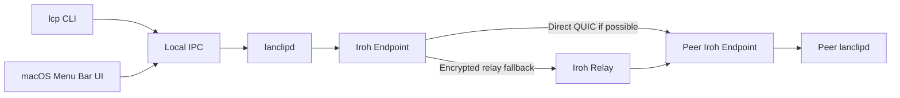

# Architecture

## System overview

`lanclipd` is the only process that opens an Iroh endpoint. `lcp` and the macOS UI are thin clients that talk to it over local IPC (a Unix domain socket on macOS, a named pipe on Windows) and never hold network state of their own. See ADR [[0005-daemon-owns-network-state]] and [[0003-iroh-instead-of-lan-tcp]] for why.

## Why a daemon is required

A CLI invocation lives only as long as the command runs, so it cannot receive messages in real time, keep the Iroh endpoint's identity warm, or reconnect peers in the background. `lanclipd` runs continuously per user to:

- accept incoming connections and store messages in RAM even when no terminal or UI is open,
- keep one stable `EndpointId` across the process's lifetime,
- reconnect trusted peers after network changes or brief drops,
- answer `copy`/`fetch`/`send` over local IPC immediately.

## Crate boundaries

| Crate | Responsibility | May depend on |
|---|---|---|
| `lcp-protocol` | Pure types, (de)serialization, versioning, error enums — no I/O | nothing in-workspace |
| `lcp-core` | Iroh endpoint, pairing, peer state, conversations, security policy | `lcp-protocol` |
| `lcp-ipc` | Cross-platform local IPC server/client transport | `lcp-protocol` |
| `lanclipd` | Process startup/shutdown/signal handling, wiring | `lcp-core`, `lcp-ipc` |
| `lcp-cli` | CLI parsing, clipboard, terminal picker, output | `lcp-protocol`, `lcp-ipc` |

`lcp-core` never depends on the CLI or the macOS UI. Types actually exchanged on the wire (`PairingTicketV1`, `NetworkEnvelope`, `IpcRequest`/`IpcResponse`/`IpcEvent`) live in `lcp-protocol` as plain serde structs with no I/O, so they can be unit-tested as pure round-trip logic. `Config`/`TrustedPeer` are not wire types in that sense -- no other process ever deserializes them as Rust values, since IPC responses carry config/peer data as `serde_json::Value` -- so they're defined directly in `lcp-core::config`, which also owns the atomic file I/O and credential-store access for them.

## Process model

`lanclipd` owns: the Iroh endpoint and secret identity, trusted peers, active invitations, peer connections, in-memory conversation history, latest-incoming-message indexes, the dedup cache, and reconnect tasks.

Clients (`lcp`, macOS UI) only: send requests over IPC, receive responses/events, and read/write the local system clipboard in their own (foreground, interactive-session) process.

## Transport decision

Iroh is responsible for endpoint identity, QUIC transport, encryption, NAT traversal, direct-path selection, relay fallback, and address lookup. The application is responsible for pairing workflow, the trusted-peer allowlist, message schema/validation, ACK/dedup, conversation state, the CLI/UI, and local IPC. See `docs/protocol.md` for the wire-level detail and `docs/security.md` for the trust model.
